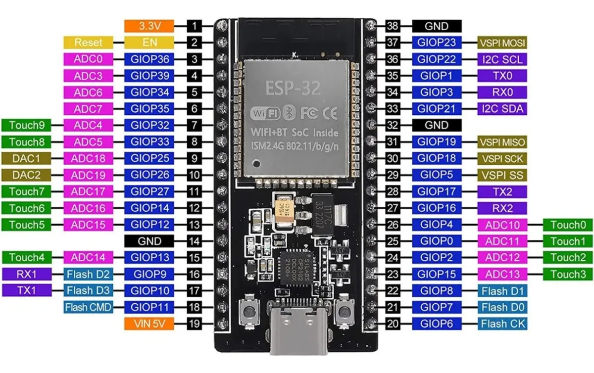

# Sistema de Riego Automático

## Índice

- [Características](#características)
- [Hardware](#hardware)
- [Stack tecnológico](#stack-tecnológico)
- [Estructura del proyecto](#estructura-del-proyecto)
- [Dominio de negocio](#dominio-de-negocio)
- [Puesta en marcha](#puesta-en-marcha)
- [API REST](#api-rest)
- [Integrantes](#integrantes)
- [Licencia](#licencia)

Sistema de riego automático controlado de forma inalámbrica mediante un **ESP32**
y una aplicación web embebida. Gestiona 8 válvulas solenoides y una bomba de agua (simuladas con LEDs
en las maquetas), organizando la zona de riego en sectores
independientes con programas configurables.

El sistema **no usa sensores**: el comportamiento es 100 % determinístico y se
ejecuta por horario, secuencia y tiempos preconfigurados.

> Proyecto académico de la materia **Construcción de Sistemas** — Universidad
> Nacional de Tres de Febrero (UNTREF), Ingeniería en Computación.

---

## Características

- **Control inalámbrico** vía Wi-Fi: el ESP32 levanta un Access Point y sirve la
  interfaz web; se accede desde celular, tablet o PC sin cables.
- **8 sectores independientes**, cada uno con su válvula, y una **bomba** central.
- **Programas como árbol de riego + caudal:** cada programa es un árbol de nodos;
  cada nodo riega un sector y cuelga de un padre o es raíz. El caudal gobierna
  cuántos sectores riegan en paralelo (`Σ caudal ≤ caudal de la bomba`); los que
  no entran esperan en una cola FIFO.
- **Programación horaria** con RTC (hora de inicio, días de la semana, ciclo
  único o repetición).
- **Control manual** de cada sector y **parada de emergencia** inmediata.
- **Estado en tiempo real** en la web por polling.
- **Persistencia** de la configuración en la memoria flash del ESP32 (LittleFS).
- **Dominio testeable sin hardware** gracias a una capa HAL y tests nativos.

---

## Hardware

| Componente        | Detalle                                                    |
|-------------------|------------------------------------------------------------|
| Microcontrolador  | NodeMCU ESP32 38 pines / ESP32 WROOM (Wi-Fi + Bluetooth integrado) |
| Válvulas          | 8 solenoides → simuladas con LEDs — GPIO 13, 14, 16, 17, 32, 33, 25, 26 |
| Bomba             | 1 bomba central → simuladas con LED — GPIO 27                                  |
| RTC               | DS1302 por bit-banging — CLK → GPIO18, DAT → GPIO19, RST → GPIO21 |
| Persistencia      | Flash interna del ESP32 (LittleFS)                         |

> Los pines, polaridades y credenciales están centralizados en
> [`src/config/Config.h`](src/config/Config.h).



_Foto del pinout del NodeMCU ESP32 38 pines usado en este proyecto._

---

## Stack tecnológico

- **Firmware:** C++ sobre el framework Arduino, compilado con **PlatformIO**.
- **Comunicación:** Wi-Fi en modo Access Point + servidor HTTP embebido.
- **API:** REST sobre HTTP (claves JSON en español, parser hand-rolled sin ArduinoJson).
- **Interfaz:** una sola página HTML/CSS/JS *vanilla*, embebida en el firmware.
- **Persistencia:** JSON en LittleFS.
- **Tests:** Unity, ejecutables en el entorno `native` de PlatformIO (sin hardware).

---

## Estructura del proyecto

```
/
├── platformio.ini              # Configuración de PlatformIO (env esp32dev y native)
├── src/
│   ├── main.cpp                # Punto de entrada (setup/loop, cableado de objetos)
│   ├── config/                 # Constantes y pines (Config.h)
│   ├── core/                   # Abstracciones HAL (Arduino, HAL, RTC, Storage)
│   ├── domain/                 # Dominio de negocio (Valve, Pump, Sector,
│   │                           #   ProgramNode, Program, IrrigationSystem)
│   ├── esp32/                  # Implementación HAL real para ESP32
│   ├── pages/                  # UI: index.html (fuente) → index_html.h (generado)
│   ├── scheduler/              # Programación horaria (Scheduler, RTCManager)
│   ├── storage/                # Persistencia en LittleFS (StorageManager)
│   └── web/                    # Servidor HTTP + API REST (WebServer, ApiHandler, JsonHelpers)
└── test/                       # Tests Unity nativos + mocks
    ├── test_domain/            # Tests relacionados al dominio general del sistema
    ├── test_rtc/               # Tests relacionados al modulo RTC
    └── test_storage/           # Tests relacionados al control de almacenamiento
```

El código usa una capa **HAL**: `core/` define las interfaces y `esp32/` las
implementa contra el hardware real. Esto permite compilar y testear el dominio en
el entorno `native` sin necesidad de un ESP32.

---

## Dominio de negocio

| Entidad            | Responsabilidad |
|--------------------|-----------------|
| `Valve`            | Una válvula solenoide: abre/cierra y reporta su estado. |
| `Pump`             | La bomba central: enciende/apaga y reporta su estado. |
| `Sector`           | Zona de riego (id 1..8): posee su válvula. |
| `ProgramNode`      | Nodo del árbol de un programa: sector, tiempo de riego, retardo, padre y caudal. |
| `Program`          | Programa completo como árbol de nodos + hora, días y ciclo. |
| `IrrigationSystem` | Fachada que coordina todo y contiene el motor de ejecución árbol + caudal. |

El motor avanza con cadencia de 1 s usando `millis()` (nunca `delay()`), y en cada
paso recalcula qué válvulas y bomba deben estar activas según los sectores que
riegan, sus retardos y la cañería (ancestros que dejan pasar el agua).

---

## Puesta en marcha

### Requisitos

- Windows
- Visual Studio Code: https://code.visualstudio.com/download
- Extensión PlatformIO IDE para VS Code: https://marketplace.visualstudio.com/items?itemName=platformio.platformio-ide
  - Alternativa: PlatformIO Core instalado globalmente usando Python:

```powershell
python -m pip install platformio
```
- Cable USB compatible con tu placa ESP32
- Módulo RTC DS1302 conectado a los pines definidos en `src/config/Config.h`

### Dependencias del proyecto

El proyecto usa PlatformIO y la plataforma `espressif32` con framework `arduino`.

En `platformio.ini` se define:

- `env:esp32dev`
  - `platform = espressif32`
  - `board = esp32dev`
  - `framework = arduino`
  - `monitor_speed = 115200`
  - `board_build.filesystem = littlefs`
  - `lib_deps = https://github.com/msparks/arduino-ds1302.git`

- `env:native`
  - Permite ejecutar tests con Unity en el host (Windows) para la lógica del dominio.

PlatformIO descargará automáticamente la dependencia del RTC DS1302.

### Pasos para ejecutar el proyecto

#### Abrir el proyecto en VS Code

1. Abra Visual Studio Code.
2. Use `Archivo > Abrir carpeta...` y seleccione la carpeta raíz del proyecto.
3. Espere a que PlatformIO cargue el proyecto y descargue las dependencias.

#### Compilar y cargar en el ESP32

1. Conecte su placa ESP32 al PC mediante USB.
2. En PlatformIO, seleccione el entorno `esp32dev`.
3. Compile usando la terminal o el botón `Build` de PlatformIO:

```powershell
pio run -e esp32dev
```

4. Cargue el firmware en la placa con la terminal o usando el botón de "flecha derecha" (Upload) de PlatformIO / VS Code:

```powershell
pio run -e esp32dev --target upload
```

5. Abra el monitor serie para ver mensajes de arranque y estado. También puede usar el botón de "enchufe" (plug icon) de PlatformIO si prefiere la interfaz gráfica:

```powershell
pio device monitor -e esp32dev
```

El monitor serie usa velocidad `115200`.

### Uso del sistema después de cargarlo

El ESP32 levanta un Access Point Wi-Fi con estas credenciales:

- SSID: `Riego-ESP32`
- Password: `riego12345`
- IP fija: `192.168.4.1`
- DNS mDNS: `riego.local`

Para acceder a la interfaz web abra en el navegador: `http://192.168.4.1`.

### Ejecutar tests locales (opcional)

El proyecto incluye un entorno de pruebas `native` usando Unity.

Para ejecutar los tests:

```powershell
pio test -e native
```

### Solución de problemas rápida

- Si PlatformIO no detecta el ESP32, verifica el puerto COM en el Administrador de dispositivos.
- Si el RTC no responde, confirma conexiones físicas y el módulo DS1302.
- Si hay errores de compilación, asegúrate de haber abierto la carpeta raíz del proyecto en VS Code.

## API REST

| Método   | Endpoint          | Descripción |
|----------|-------------------|-------------|
| GET      | `/estado`         | Estado actual: activos, pendientes, cola, completados y bomba. |
| GET      | `/programas`      | Caudal de la bomba + todos los programas (formato árbol). |
| POST     | `/configuracion`  | Acciones: guardar programa, borrar, ejecutar, fijar caudal. |
| GET      | `/control`        | `?type=sector&id=N&state=0\|1` — encender/apagar un sector manual. |
| POST     | `/parada`         | Parada manual inmediata. |
| GET/POST | `/rtc`            | Leer / fijar la hora del RTC. |

Las claves JSON están en español (contrato con la UI); los miembros C++ en inglés.
Toda la serialización/parsing vive en `web/ApiHandler` + `web/JsonHelpers`.

### Ejemplo — `GET /programas`

```json
{
  "caudalBomba": 20,
  "programas": [
    {
      "id": 1, "horaInicio": "07:00", "dias": 62, "ciclico": false,
      "nodos": [
        { "sectorId": 1, "tiempoRiego": 15, "retardo": 0, "padre": null, "caudal": 12 },
        { "sectorId": 2, "tiempoRiego": 12, "retardo": 3, "padre": 1,    "caudal": 6  }
      ]
    }
  ]
}
```

---

## Instalación y ejecución del proyecto

### 1. Requisitos previos

- Windows
- Visual Studio Code: https://code.visualstudio.com/download
- Extensión PlatformIO IDE para VS Code: https://marketplace.visualstudio.com/items?itemName=platformio.platformio-ide
  - Alternativa: PlatformIO Core instalado globalmente usando Python
- Cable USB compatible con tu placa ESP32
- Módulo RTC DS1302 conectado a los pines definidos en `src/config/Config.h`

### 2. Dependencias del proyecto

El proyecto usa PlatformIO y la plataforma `espressif32` con framework `arduino`.

En `platformio.ini` se define:

- `env:esp32dev`
  - `platform = espressif32`
  - `board = esp32dev`
  - `framework = arduino`
  - `monitor_speed = 115200`
  - `board_build.filesystem = littlefs`
  - `lib_deps = https://github.com/msparks/arduino-ds1302.git`

- `env:native`
  - Permite ejecutar tests con Unity en el host (Windows) para la lógica del dominio.

PlatformIO descargará automáticamente la dependencia del RTC DS1302.

### 3. Pasos para ejecutar el proyecto

#### 3.1 Abrir el proyecto en VS Code

1. Abra Visual Studio Code.
2. Use `Archivo > Abrir carpeta...` y seleccione la carpeta raíz del proyecto.
3. Espere a que PlatformIO cargue el proyecto y descargue las dependencias.

#### 3.2 Compilar y cargar en el ESP32

1. Conecte su placa ESP32 al PC mediante USB.
2. En PlatformIO, seleccione el entorno `esp32dev`.
3. Compile usando la terminal o el botón `Build` de PlatformIO:

```powershell
pio run -e esp32dev
```

4. Cargue el firmware en la placa con la terminal o usando el botón de "flecha derecha" (Upload) de PlatformIO / VS Code:

```powershell
pio run -e esp32dev --target upload
```

5. Abra el monitor serie para ver mensajes de arranque y estado. También puede usar el botón de "enchufe" (plug icon) de PlatformIO si prefiere la interfaz gráfica:

```powershell
pio device monitor -e esp32dev
```

El monitor serie usa velocidad `115200`.

### 4. Uso del sistema después de cargarlo

El ESP32 levanta un Access Point Wi-Fi con estas credenciales:

- SSID: `Riego-ESP32`
- Password: `riego12345`
- IP fija: `192.168.4.1`
- DNS mDNS: `riego.local`

Para acceder a la interfaz web abra en el navegador: `http://192.168.4.1`.

### 5. Ejecutar tests locales (opcional)

El proyecto incluye un entorno de pruebas `native` usando Unity.

Para ejecutar los tests:

```powershell
pio test -e native
```

### 6. Solución de problemas rápida

- Si PlatformIO no detecta el ESP32, verifica el puerto COM en el Administrador de dispositivos.
- Si el RTC no responde, confirma conexiones físicas y el módulo DS1302.
- Si hay errores de compilación, asegúrate de haber abierto la carpeta raíz del proyecto en VS Code.

---

## Licencia

Proyecto académico — UNTREF, Construcción de Sistemas.

---

## Integrantes

Di Leo Tomás · Massimino Agustín · Chavez Matías · Schnidrig Alejandro · Iannuzzi Gianluca · Biscardi Maximiliano
